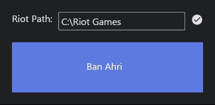

# Ban Ahri Client

This is a Rust application that allows you to manually ban the champion Ahri during the champion select phase in League of Legends. The application uses the Riot API and is built with asynchronous Rust and the Iced GUI library.



## Features

- Manually ban Ahri during the champion select phase.
- Simple GUI to initiate the ban process.
- Displays a GIF when Ahri is successfully banned.

## Requirements

- Rust (latest stable version recommended)
- League of Legends installed on your system
- Access to the Riot API (make sure the client is running)

## Installation

1. Clone the repository:

    ```sh
    git clone https://github.com/gqsnt/ban_ahri_client.git
    cd ban_ahri_client
    ```

2. Build the application:

    ```sh
    cargo build --release
    ```

3. Run the application:

    ```sh
    cargo run --release
    ```

## Usage

1. Start the application:

    ```sh
    cargo run --release
    ```

2. Enter the Riot Games installation path in the provided text input field.

3. Click the "Ban Ahri" button to ban Ahri if you are in the ban phase of the champion select phase.

4. A GIF will be displayed when Ahri is successfully banned.

