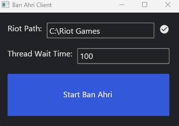

# Ban Ahri Client

This is a Rust application that automatically bans the champion Ahri during the champion select phase in League of Legends. The application uses the Riot API and is built with asynchronous Rust and the Iced GUI library.




## Features

- Automatically ban Ahri during the champion select phase.
- Simple GUI to start and stop the automatic ban process.
- Configurable thread wait time for checking the champion select session.

## Requirements

- Rust (latest stable version recommended)
- League of Legends installed on your system
- Access to the Riot API (make sure the client is running)

## Installation

1. Clone the repository:

    ```sh
    git clone https://github.com/gqsnt/ban_ahri_client.git
    cd ban-ahri-client
    ```

2. Build the application:

    ```sh
    cargo build --release
    ```

3. Run the application:

    ```sh
    cargo run --release
    ```

## Usage

1. Start the application:

    ```sh
    cargo run --release
    ```

2. Enter the Riot Games installation path in the provided text input field.

3. Click the "Start Ban Ahri" button to begin automatically banning Ahri if you enter ban phase in the champion select phase.

4. Click the "Stop Ban Ahri" button to stop the process.

5. Adjust the thread wait time if needed to change how often the application checks for the champion select phase.


